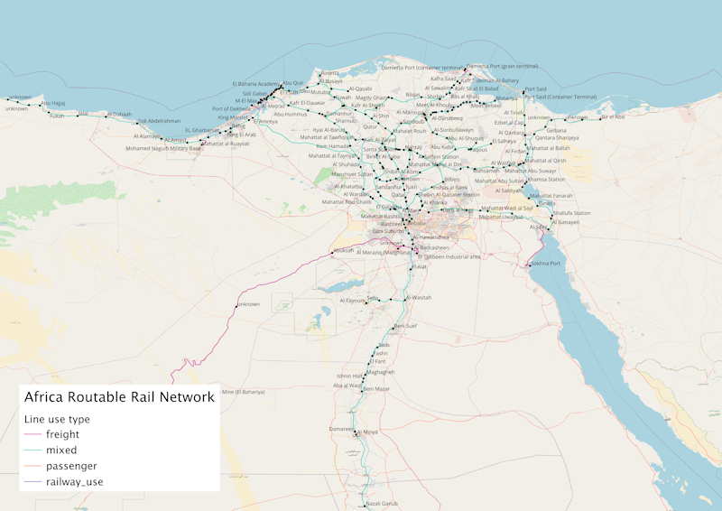

# An Open Source Routable Rail Dataset For Africa

The aim of this project was to extend previous work to create a routable rail network for East Africa (Kenya, Uganda, Tanzania, and Zambia) to the rest of the African continent. The network is created within a PostgreSQL spatial database and is suitable for routing using the pgRouting extension (or similar tool).

Due to the extensive nature of the existing networks in some countries (including light rail, subway and tram), and a large number of construction schemes and scheme proposals, the decision was made to primarily concentrate on creating an accurate routable network of the existing heavy rail lines currently in use in each country. 

The countries processed have been thoroughly researched based on information available via web-based sources. A document summarising findings and with links to key sources has been created for each country or group of countries and key documents and maps have been downloaded.

The rail network created identifies the track gauge (including dual gauge where applicable) and whether lines are used for passenger and/or freight services. In general it has been assumed that lines are used for both freight and passenger services (mixed) unless information indicates that they are freight or (rarely) passenger only. Where branch lines or spurs are clearly only servicing industrial locations (such as ports, mines, chemical plants etc.) they have been recorded as freight only.

As with the previous work in East Africa, a single line is used to represent the network irrespective of the number of physical tracks (unless alternate gauges exist) and where possible an existing line mapped in OpenStreetMap has been used. It has sometimes been necessary to insert fictitious edges to simplify the network (for example when routing in/out of stations on alternative branches).

In total the created network is 82,301 km in length with 5327 stations/stops.

Here is an example routing query (showing named stops passed through only) from the International  Container Terminal at Dar es Salaam, Tanzania to Port of Richards Bay Coal Terminal, South Africa; passing through Zambia and Zimbabwe.

| Seq  | Aggregate cost (km) | Line                                                    | Line status | Gauge | Country      | Stop type | Stop name                            |
| ---- | ------------------- | ------------------------------------------------------- | ----------- | ----- | ------------ | --------- | ------------------------------------ |
| 1    | 0.00                | Yombo -  Kurasini / Container Terminal (Tazara)         | open        | 1067  | Tanzania     | stop      | International  Container Terminal    |
| 27   | 9.34                | TAZARA (Tanzania)                                       | open        | 1067  | Tanzania     | station   | Yombo                                |
| 28   | 9.81                | TAZARA  (Tanzania)                                      | open        | 1067  | Tanzania     | station   | Kwa  Limboa                          |
| 33   | 10.91               | TAZARA (Tanzania)                                       | open        | 1067  | Tanzania     | station   | Lumo (Kigilagila)                    |
| 34   | 12.61               | TAZARA  (Tanzania)                                      | open        | 1067  | Tanzania     | station   | Veta                                 |
| 38   | 15.01               | TAZARA (Tanzania)                                       | open        | 1067  | Tanzania     | station   | Kitunda                              |
| 48   | 16.70               | TAZARA  (Tanzania)                                      | open        | 1067  | Tanzania     | station   | Kipunguni  B                         |
| 57   | 17.56               | TAZARA (Tanzania)                                       | open        | 1067  | Tanzania     | station   | Moshi Bar                            |
| 60   | 19.14               | TAZARA  (Tanzania)                                      | open        | 1067  | Tanzania     | station   | Songosongo                           |
| 64   | 20.90               | TAZARA (Tanzania)                                       | open        | 1067  | Tanzania     | station   | Majohe                               |
| 66   | 22.22               | TAZARA  (Tanzania)                                      | open        | 1067  | Tanzania     | station   | Magnus  Secondary                    |
| 71   | 24.44               | TAZARA (Tanzania)                                       | open        | 1067  | Tanzania     | station   | Mwakanga                             |
| 107  | 48.35               | TAZARA  (Tanzania)                                      | open        | 1067  | Tanzania     | station   | Kifuru                               |
| 116  | 76.77               | TAZARA (Tanzania)                                       | open        | 1067  | Tanzania     | station   | Mzenga                               |
| 122  | 109.21              | TAZARA  (Tanzania)                                      | open        | 1067  | Tanzania     | station   | Gwata                                |
| 126  | 136.97              | TAZARA (Tanzania)                                       | open        | 1067  | Tanzania     | station   | Kidunda                              |
| 128  | 168.14              | TAZARA  (Tanzania)                                      | open        | 1067  | Tanzania     | station   | Kinyanguru                           |
| 134  | 197.42              | TAZARA (Tanzania)                                       | open        | 1067  | Tanzania     | station   | Fuga                                 |
| 142  | 205.17              | TAZARA  (Tanzania)                                      | open        | 1067  | Tanzania     | halt      | Matambwe                             |
| 154  | 223.22              | TAZARA (Tanzania)                                       | open        | 1067  | Tanzania     | station   | Kisaki                               |
| 172  | 308.59              | TAZARA  (Tanzania)                                      | open        | 1067  | Tanzania     | crossing  | Kidatu  junction                     |
| 176  | 309.77              | TAZARA (Tanzania)                                       | open        | 1067  | Tanzania     | station   | Msolwa                               |
| 191  | 327.50              | TAZARA  (Tanzania)                                      | open        | 1067  | Tanzania     | station   | Mang’ula                             |
| 205  | 339.42              | TAZARA (Tanzania)                                       | open        | 1067  | Tanzania     | station   | Kiberege                             |
| 218  | 366.31              | TAZARA  (Tanzania)                                      | open        | 1067  | Tanzania     | station   | Ifakara                              |
| 245  | 400.38              | TAZARA (Tanzania)                                       | open        | 1067  | Tanzania     | station   | Ruipa                                |
| 253  | 418.77              | TAZARA  (Tanzania)                                      | open        | 1067  | Tanzania     | station   | Mbingu                               |
| 259  | 436.59              | TAZARA (Tanzania)                                       | open        | 1067  | Tanzania     | station   | Mngeta                               |
| 273  | 453.68              | TAZARA  (Tanzania)                                      | open        | 1067  | Tanzania     | halt      | Ikule                                |
| 284  | 468.43              | TAZARA (Tanzania)                                       | open        | 1067  | Tanzania     | station   | Chita                                |
| 305  | 502.37              | TAZARA  (Tanzania)                                      | open        | 1067  | Tanzania     | station   | Mlimba                               |
| 319  | 515.45              | TAZARA (Tanzania)                                       | open        | 1067  | Tanzania     | station   | Lumumwe                              |
| 356  | 541.08              | TAZARA  (Tanzania)                                      | open        | 1067  | Tanzania     | station   | Mpanga                               |
| 394  | 562.31              | TAZARA (Tanzania)                                       | open        | 1067  | Tanzania     | station   | Kitete                               |
| 427  | 575.63              | TAZARA  (Tanzania)                                      | open        | 1067  | Tanzania     | station   | Uchindile                            |
| 447  | 603.03              | TAZARA (Tanzania)                                       | open        | 1067  | Tanzania     | station   | Kiyowela                             |
| 458  | 627.65              | TAZARA  (Tanzania)                                      | open        | 1067  | Tanzania     | station   | Kitandalila                          |
| 461  | 640.23              | TAZARA (Tanzania)                                       | open        | 1067  | Tanzania     | station   | Mahongole                            |
| 469  | 657.94              | TAZARA  (Tanzania)                                      | open        | 1067  | Tanzania     | station   | Makambako                            |
| 476  | 677.90              | TAZARA (Tanzania)                                       | open        | 1067  | Tanzania     | station   | Wanging’mbe                          |
| 483  | 697.03              | TAZARA  (Tanzania)                                      | open        | 1067  | Tanzania     | station   | Kangaga                              |
| 486  | 711.33              | TAZARA (Tanzania)                                       | open        | 1067  | Tanzania     | station   | Rujewa                               |
| 494  | 727.17              | TAZARA  (Tanzania)                                      | open        | 1067  | Tanzania     | station   | Msesule                              |
| 506  | 755.85              | TAZARA (Tanzania)                                       | open        | 1067  | Tanzania     | station   | Chimala                              |
| 514  | 775.85              | TAZARA  (Tanzania)                                      | open        | 1067  | Tanzania     | station   | Igurusi                              |
| 521  | 790.85              | TAZARA (Tanzania)                                       | open        | 1067  | Tanzania     | station   | Ilongo                               |
| 546  | 806.58              | TAZARA  (Tanzania)                                      | open        | 1067  | Tanzania     | station   | Malamba  Station                     |
| 571  | 817.00              | TAZARA (Tanzania)                                       | open        | 1067  | Tanzania     | station   | Lumba                                |
| 588  | 829.29              | TAZARA  (Tanzania)                                      | open        | 1067  | Tanzania     | station   | Inyala                               |
| 620  | 839.36              | TAZARA (Tanzania)                                       | open        | 1067  | Tanzania     | station   | Uyole                                |
| 662  | 855.28              | TAZARA  (Tanzania)                                      | open        | 1067  | Tanzania     | station   | Mbeya  Station                       |
| 685  | 866.57              | TAZARA (Tanzania)                                       | open        | 1067  | Tanzania     | station   | Mbalizi                              |
| 712  | 878.54              | TAZARA  (Tanzania)                                      | open        | 1067  | Tanzania     | station   | Idiga                                |
| 735  | 896.05              | TAZARA (Tanzania)                                       | open        | 1067  | Tanzania     | station   | Chikola                              |
| 766  | 921.92              | TAZARA  (Tanzania)                                      | open        | 1067  | Tanzania     | station   | Mlowo                                |
| 773  | 932.74              | TAZARA (Tanzania)                                       | open        | 1067  | Tanzania     | station   | Vwawa                                |
| 797  | 959.03              | TAZARA  (Tanzania)                                      | open        | 1067  | Tanzania     | station   | Mpemba                               |
| 807  | 976.16              | TAZARA (Tanzania)                                       | open        | 1067  | Tanzania     | station   | Tunduma                              |
| 813  | 977.65              | TAZARA (Zambia)                                         | open        | 1067  | Zambia       | station   | Nakonde                              |
| 826  | 988.62              | TAZARA (Zambia)                                         | open        | 1067  | Zambia       | station   | Mwenzo                               |
| 831  | 996.66              | TAZARA (Zambia)                                         | open        | 1067  | Zambia       | station   | Msanza                               |
| 841  | 1015.15             | TAZARA (Zambia)                                         | open        | 1067  | Zambia       | station   | Kawila                               |
| 856  | 1044.56             | TAZARA (Zambia)                                         | open        | 1067  | Zambia       | station   | Kalulu                               |
| 862  | 1072.60             | TAZARA (Zambia)                                         | open        | 1067  | Zambia       | station   | unnamed                              |
| 868  | 1094.61             | TAZARA (Zambia)                                         | open        | 1067  | Zambia       | halt      | unnamed                              |
| 869  | 1109.54             | TAZARA (Zambia)                                         | open        | 1067  | Zambia       | station   | Makasa                               |
| 883  | 1142.48             | TAZARA (Zambia)                                         | open        | 1067  | Zambia       | station   | Kayaya                               |
| 886  | 1157.64             | TAZARA (Zambia)                                         | open        | 1067  | Zambia       | station   | Chimba                               |
| 902  | 1189.90             | TAZARA (Zambia)                                         | open        | 1067  | Zambia       | station   | Nseluka                              |
| 909  | 1219.40             | TAZARA (Zambia)                                         | open        | 1067  | Zambia       | station   | Kungu                                |
| 918  | 1228.93             | TAZARA (Zambia)                                         | open        | 1067  | Zambia       | station   | Kasama                               |
| 928  | 1261.58             | TAZARA (Zambia)                                         | open        | 1067  | Zambia       | station   | Nkolemfumu                           |
| 940  | 1279.09             | TAZARA (Zambia)                                         | open        | 1067  | Zambia       | station   | Ishitu                               |
| 952  | 1312.04             | TAZARA (Zambia)                                         | open        | 1067  | Zambia       | station   | Chambeshi                            |
| 958  | 1326.13             | TAZARA (Zambia)                                         | open        | 1067  | Zambia       | station   | Mpepo                                |
| 968  | 1355.60             | TAZARA (Zambia)                                         | open        | 1067  | Zambia       | station   | Kasongo                              |
| 974  | 1383.25             | TAZARA (Zambia)                                         | open        | 1067  | Zambia       | station   | Kabuka                               |
| 984  | 1408.69             | TAZARA (Zambia)                                         | open        | 1067  | Zambia       | station   | Sabwa                                |
| 998  | 1420.73             | TAZARA (Zambia)                                         | open        | 1067  | Zambia       | station   | Mpika                                |
| 1011 | 1444.84             | TAZARA (Zambia)                                         | open        | 1067  | Zambia       | station   | Chilonga                             |
| 1028 | 1465.75             | TAZARA (Zambia)                                         | open        | 1067  | Zambia       | halt      | Kapoko                               |
| 1041 | 1489.93             | TAZARA (Zambia)                                         | open        | 1067  | Zambia       | station   | Kalonje                              |
| 1058 | 1532.14             | TAZARA (Zambia)                                         | open        | 1067  | Zambia       | station   | Finkuli                              |
| 1069 | 1576.47             | TAZARA (Zambia)                                         | open        | 1067  | Zambia       | station   | Luslwasi                             |
| 1073 | 1590.28             | TAZARA (Zambia)                                         | open        | 1067  | Zambia       | station   | Kanona                               |
| 1082 | 1613.89             | TAZARA (Zambia)                                         | open        | 1067  | Zambia       | station   | Chakalamo                            |
| 1102 | 1660.97             | TAZARA (Zambia)                                         | open        | 1067  | Zambia       | station   | Serenje                              |
| 1116 | 1716.95             | TAZARA (Zambia)                                         | open        | 1067  | Zambia       | station   | Ndabala                              |
| 1127 | 1731.74             | TAZARA (Zambia)                                         | open        | 1067  | Zambia       | station   | Mkushi  River                        |
| 1136 | 1744.32             | TAZARA (Zambia)                                         | open        | 1067  | Zambia       | station   | Nkolonga                             |
| 1151 | 1769.86             | TAZARA (Zambia)                                         | open        | 1067  | Zambia       | station   | Mkushi                               |
| 1172 | 1814.43             | TAZARA (Zambia)                                         | open        | 1067  | Zambia       | station   | Lunsemfwa                            |
| 1205 | 1860.05             | TAZARA - Kapiri  Mposhi Junction                        | open        | 1067  | Zambia       | station   | New  Kapiri Mposhi                   |
| 1211 | 1862.18             | Livingstone - Ndola                                     | open        | 1067  | Zambia       | station   | Kapiri Mposhi ZR Station             |
| 1221 | 1887.97             | Livingstone -  Ndola                                    | open        | 1067  | Zambia       | station   | unnamed                              |
| 1238 | 1923.97             | Livingstone - Ndola                                     | open        | 1067  | Zambia       | station   | Kabwe                                |
| 1245 | 1940.31             | Livingstone -  Ndola                                    | open        | 1067  | Zambia       | station   | Kasavasa  Siding                     |
| 1255 | 1963.62             | Livingstone - Ndola                                     | open        | 1067  | Zambia       | station   | Chikonkomene Siding                  |
| 1265 | 1977.29             | Livingstone -  Ndola                                    | open        | 1067  | Zambia       | station   | Miswa  Siding                        |
| 1276 | 1991.35             | Livingstone - Ndola                                     | open        | 1067  | Zambia       | station   | Chisamba                             |
| 1282 | 2010.89             | Livingstone -  Ndola                                    | open        | 1067  | Zambia       | station   | Karubwe  Siding                      |
| 1286 | 2029.28             | Livingstone - Ndola                                     | open        | 1067  | Zambia       | station   | Ngwerere station                     |
| 1313 | 2044.41             | Livingstone -  Ndola                                    | open        | 1067  | Zambia       | station   | Lusaka                               |
| 1314 | 2044.44             | Livingstone - Ndola                                     | open        | 1067  | Zambia       | station   | Lusaka Railway Station               |
| 1327 | 2054.83             | Livingstone -  Ndola                                    | open        | 1067  | Zambia       | station   | Lilayi                               |
| 1353 | 2092.41             | Livingstone - Ndola                                     | open        | 1067  | Zambia       | station   | Kafue                                |
| 1360 | 2110.77             | Livingstone -  Ndola                                    | open        | 1067  | Zambia       | station   | Nega  Nega                           |
| 1367 | 2127.78             | Livingstone - Ndola                                     | open        | 1067  | Zambia       | station   | Lubombo                              |
| 1373 | 2140.33             | Livingstone -  Ndola                                    | open        | 1067  | Zambia       | station   | Mazabuka                             |
| 1402 | 2165.60             | Livingstone - Ndola                                     | open        | 1067  | Zambia       | station   | Magoye                               |
| 1417 | 2200.43             | Livingstone -  Ndola                                    | open        | 1067  | Zambia       | station   | Monze                                |
| 1436 | 2236.62             | Livingstone - Ndola                                     | open        | 1067  | Zambia       | station   | Pemba                                |
| 1449 | 2270.65             | Livingstone -  Ndola                                    | open        | 1067  | Zambia       | station   | Batoka                               |
| 1459 | 2301.38             | Livingstone - Ndola                                     | open        | 1067  | Zambia       | station   | Choma                                |
| 1486 | 2371.97             | Livingstone -  Ndola                                    | open        | 1067  | Zambia       | station   | Kalomo                               |
| 1506 | 2427.09             | Livingstone - Ndola                                     | open        | 1067  | Zambia       | station   | Zimba                                |
| 1523 | 2476.65             | Livingstone -  Ndola                                    | open        | 1067  | Zambia       | station   | Senkobo                              |
| 1539 | 2509.25             | Livingstone - Ndola                                     | open        | 1067  | Zambia       | station   | Livingstone                          |
| 1557 | 2521.92             | Bulawayo -  Victoria Falls (Zambia border)              | open        | 1067  | Zimbabwe     | station   | Victoria  Falls                      |
| 1632 | 2642.20             | Bulawayo - Victoria Falls (Zambia border)               | open        | 1067  | Zimbabwe     | station   | Hwange Station (Thomson Junction)    |
| 1661 | 2726.24             | Bulawayo -  Victoria Falls (Zambia border)              | open        | 1067  | Zimbabwe     | station   | Dete  Station                        |
| 1667 | 2747.79             | Bulawayo - Victoria Falls (Zambia border)               | open        | 1067  | Zimbabwe     | stop      | Malindi Siding                       |
| 1669 | 2767.85             | Bulawayo -  Victoria Falls (Zambia border)              | open        | 1067  | Zimbabwe     | stop      | Kennedy  Siding                      |
| 1670 | 2778.46             | Bulawayo - Victoria Falls (Zambia border)               | open        | 1067  | Zimbabwe     | stop      | Mukwa Siding                         |
| 1673 | 2787.62             | Bulawayo -  Victoria Falls (Zambia border)              | open        | 1067  | Zimbabwe     | stop      | Inthundla  Siding                    |
| 1687 | 2842.27             | Bulawayo - Victoria Falls (Zambia border)               | open        | 1067  | Zimbabwe     | station   | Gwaai Station                        |
| 1696 | 2891.75             | Bulawayo -  Victoria Falls (Zambia border)              | open        | 1067  | Zimbabwe     | station   | Sawmill  Train Station               |
| 1702 | 2907.22             | Bulawayo - Victoria Falls (Zambia border)               | open        | 1067  | Zimbabwe     | halt      | Ingusi                               |
| 1708 | 2939.84             | Bulawayo -  Victoria Falls (Zambia border)              | open        | 1067  | Zimbabwe     | halt      | Nyamandolovu                         |
| 1737 | 2999.90             | Beira-Bulawayo Railway (Bulawayo - Harare)              | open        | 1067  | Zimbabwe     | station   | Cement                               |
| 1864 | 3331.57             | Beitbridge  Bulawayo Railway (BBR)                      | open        | 1067  | Zimbabwe     | stop      | Beitbridge  (BBR)                    |
| 1883 | 3351.90             | Musina (Zimbabwe border) - Pyramid                      | open        | 1067  | South Africa | station   | Messina                              |
| 1899 | 3365.07             | Musina  (Zimbabwe border) - Pyramid                     | open        | 1067  | South Africa | station   | Kamkusi                              |
| 1905 | 3372.20             | Musina (Zimbabwe border) - Pyramid                      | open        | 1067  | South Africa | halt      | Skelmwater                           |
| 1922 | 3382.61             | Musina  (Zimbabwe border) - Pyramid                     | open        | 1067  | South Africa | abandoned | Lilliput                             |
| 1927 | 3393.98             | Musina (Zimbabwe border) - Pyramid                      | open        | 1067  | South Africa | station   | Mopane                               |
| 1931 | 3403.57             | Musina  (Zimbabwe border) - Pyramid                     | open        | 1067  | South Africa | halt      | Huntleigh                            |
| 1932 | 3413.16             | Musina (Zimbabwe border) - Pyramid                      | open        | 1067  | South Africa | halt      | Pylkop                               |
| 1933 | 3422.24             | Musina  (Zimbabwe border) - Pyramid                     | open        | 1067  | South Africa | station   | Hardepad                             |
| 1935 | 3425.64             | Musina (Zimbabwe border) - Pyramid                      | open        | 1067  | South Africa | halt      | Baobab                               |
| 1937 | 3434.89             | Musina  (Zimbabwe border) - Pyramid                     | open        | 1067  | South Africa | station   | Waterpoort                           |
| 1938 | 3438.43             | Musina (Zimbabwe border) - Pyramid                      | open        | 1067  | South Africa | halt      | Phareng                              |
| 1949 | 3454.30             | Musina  (Zimbabwe border) - Pyramid                     | open        | 1067  | South Africa | station   | Mara                                 |
| 1951 | 3461.81             | Musina (Zimbabwe border) - Pyramid                      | open        | 1067  | South Africa | station   | Cilliersrus                          |
| 1953 | 3468.16             | Musina  (Zimbabwe border) - Pyramid                     | open        | 1067  | South Africa | halt      | Schoemansdal                         |
| 1956 | 3481.52             | Musina (Zimbabwe border) - Pyramid                      | open        | 1067  | South Africa | station   | Louis Trichardt                      |
| 1964 | 3494.59             | Musina  (Zimbabwe border) - Pyramid                     | open        | 1067  | South Africa | station   | Madombidzha                          |
| 1965 | 3502.74             | Musina (Zimbabwe border) - Pyramid                      | open        | 1067  | South Africa | halt      | Granite                              |
| 1970 | 3516.18             | Musina  (Zimbabwe border) - Pyramid                     | open        | 1067  | South Africa | station   | Bandelierkop                         |
| 1971 | 3527.19             | Musina (Zimbabwe border) - Pyramid                      | open        | 1067  | South Africa | station   | Mannamead                            |
| 1975 | 3539.86             | Musina  (Zimbabwe border) - Pyramid                     | open        | 1067  | South Africa | station   | Groot-Spelonke                       |
| 1977 | 3546.04             | Musina (Zimbabwe border) - Pyramid                      | open        | 1067  | South Africa | station   | Soekmekaar                           |
| 1986 | 3578.14             | Groenbult -  Kapnuiden                                  | open        | 1067  | South Africa | station   | Goudplaas                            |
| 1990 | 3582.61             | Groenbult - Kapnuiden                                   | open        | 1067  | South Africa | station   | Baskloof                             |
| 1992 | 3587.56             | Groenbult -  Kapnuiden                                  | open        | 1067  | South Africa | station   | Cordier                              |
| 1995 | 3596.13             | Groenbult - Kapnuiden                                   | open        | 1067  | South Africa | station   | Mooketsi                             |
| 2001 | 3602.16             | Groenbult -  Kapnuiden                                  | open        | 1067  | South Africa | station   | Brandboontjies                       |
| 2002 | 3608.11             | Groenbult - Kapnuiden                                   | open        | 1067  | South Africa | station   | Witkrans                             |
| 2003 | 3616.67             | Groenbult -  Kapnuiden                                  | open        | 1067  | South Africa | station   | Duiwelkloof                          |
| 2005 | 3622.96             | Groenbult - Kapnuiden                                   | open        | 1067  | South Africa | halt      | Westfalia                            |
| 2007 | 3627.70             | Groenbult -  Kapnuiden                                  | open        | 1067  | South Africa | station   | Politsi                              |
| 2024 | 3642.48             | Groenbult - Kapnuiden                                   | open        | 1067  | South Africa | station   | Tzaneen                              |
| 2031 | 3647.51             | Groenbult -  Kapnuiden                                  | open        | 1067  | South Africa | station   | Letsie                               |
| 2033 | 3655.71             | Groenbult - Kapnuiden                                   | open        | 1067  | South Africa | station   | Letaba                               |
| 2035 | 3658.49             | Groenbult -  Kapnuiden                                  | open        | 1067  | South Africa | halt      | Orangedene                           |
| 2038 | 3661.92             | Groenbult - Kapnuiden                                   | open        | 1067  | South Africa | halt      | Mariveni                             |
| 2043 | 3665.06             | Groenbult -  Kapnuiden                                  | open        | 1067  | South Africa | halt      | Lesitele  Tank                       |
| 2044 | 3668.75             | Groenbult - Kapnuiden                                   | open        | 1067  | South Africa | station   | Letsitele                            |
| 2050 | 3687.95             | Groenbult -  Kapnuiden                                  | open        | 1067  | South Africa | station   | Rubbervale                           |
| 2052 | 3695.32             | Groenbult - Kapnuiden                                   | open        | 1067  | South Africa | station   | Gravelotte                           |
| 2054 | 3695.99             | Groenbult -  Kapnuiden                                  | open        | 1067  | South Africa | station   | Gravelotte                           |
| 2062 | 3704.96             | Groenbult - Kapnuiden                                   | open        | 1067  | South Africa | halt      | Selatirivier                         |
| 2064 | 3709.45             | Groenbult -  Kapnuiden                                  | open        | 1067  | South Africa | halt      | Corundum                             |
| 2070 | 3733.09             | Groenbult - Kapnuiden                                   | open        | 1067  | South Africa | station   | Mica                                 |
| 2079 | 3753.10             | Groenbult -  Kapnuiden                                  | open        | 1067  | South Africa | station   | Olifantstenk                         |
| 2090 | 3764.78             | Groenbult - Kapnuiden                                   | open        | 1067  | South Africa | station   | Hoedspruit                           |
| 2108 | 3775.27             | Groenbult -  Kapnuiden                                  | open        | 1067  | South Africa | halt      | Drakensig                            |
| 2110 | 3781.42             | Groenbult - Kapnuiden                                   | open        | 1067  | South Africa | station   | Kapama                               |
| 2116 | 3788.13             | Groenbult -  Kapnuiden                                  | open        | 1067  | South Africa | station   | Klaserie                             |
| 2120 | 3796.68             | Groenbult - Kapnuiden                                   | open        | 1067  | South Africa | station   | Acornhoek                            |
| 2138 | 3821.92             | Groenbult -  Kapnuiden                                  | open        | 1067  | South Africa | halt      | Rolle                                |
| 2144 | 3827.00             | Groenbult - Kapnuiden                                   | open        | 1067  | South Africa | abandoned | Hokwe                                |
| 2153 | 3834.87             | Groenbult -  Kapnuiden                                  | open        | 1067  | South Africa | halt      | Matshaye                             |
| 2156 | 3842.47             | Groenbult - Kapnuiden                                   | open        | 1067  | South Africa | halt      | Ireagh                               |
| 2173 | 3856.90             | Groenbult -  Kapnuiden                                  | open        | 1067  | South Africa | station   | Mkhuhlu                              |
| 2184 | 3864.92             | Groenbult - Kapnuiden                                   | open        | 1067  | South Africa | station   | Hazyview                             |
| 2247 | 3940.32             | Komatipoort  (Mozambique border) - Rayton               | open        | 1067  | South Africa | station   | Magnesite                            |
| 2254 | 3946.29             | Komatipoort (Mozambique border) - Rayton                | open        | 1067  | South Africa | station   | Malalane station                     |
| 2332 | 4115.52             | Goba line  (Matsapha - Mlawula)                         | open        | 1067  | Eswatini     | station   | Mpaka                                |
| 2363 | 4190.42             | Richards Bay Line (Phuzumoya - SA border)               | open        | 1067  | Eswatini     | halt      | Big Bend Station                     |
| 2392 | 4254.99             | Golela  (Eswatini border) - Nseleni (Richards Bay Line) | open        | 1067  | South Africa | halt      | Leeuspoor                            |
| 2404 | 4262.83             | Golela (Eswatini border) - Nseleni (Richards Bay Line)  | open        | 1067  | South Africa |           | Kingholm                             |
| 2414 | 4271.23             | Golela  (Eswatini border) - Nseleni (Richards Bay Line) | open        | 1067  | South Africa | halt      | Candover                             |
| 2423 | 4279.74             | Golela (Eswatini border) - Nseleni (Richards Bay Line)  | open        | 1067  | South Africa | halt      | Nkonkoni                             |
| 2427 | 4289.88             | Golela  (Eswatini border) - Nseleni (Richards Bay Line) | open        | 1067  | South Africa | station   | Mkuze                                |
| 2444 | 4315.83             | Golela (Eswatini border) - Nseleni (Richards Bay Line)  | open        | 1067  | South Africa | halt      | Bayala                               |
| 2456 | 4328.39             | Golela  (Eswatini border) - Nseleni (Richards Bay Line) | open        | 1067  | South Africa | halt      | Mhlosinga                            |
| 2460 | 4339.25             | Golela (Eswatini border) - Nseleni (Richards Bay Line)  | open        | 1067  | South Africa | halt      | Ngweni                               |
| 2468 | 4349.97             | Golela  (Eswatini border) - Nseleni (Richards Bay Line) | open        | 1067  | South Africa | station   | Hluhluwe                             |
| 2475 | 4355.79             | Golela (Eswatini border) - Nseleni (Richards Bay Line)  | open        | 1067  | South Africa | halt      | Ncemane                              |
| 2478 | 4360.41             | Golela  (Eswatini border) - Nseleni (Richards Bay Line) | open        | 1067  | South Africa | halt      | Bushlands                            |
| 2485 | 4369.06             | Golela (Eswatini border) - Nseleni (Richards Bay Line)  | open        | 1067  | South Africa | halt      | Mfekayi                              |
| 2493 | 4375.19             | Golela  (Eswatini border) - Nseleni (Richards Bay Line) | open        | 1067  | South Africa | halt      | Nyalazi  River                       |
| 2497 | 4382.95             | Golela (Eswatini border) - Nseleni (Richards Bay Line)  | open        | 1067  | South Africa | halt      | Fernwood                             |
| 2509 | 4401.47             | Golela  (Eswatini border) - Nseleni (Richards Bay Line) | open        | 1067  | South Africa | station   | Mtubatuba                            |
| 2518 | 4409.00             | Golela (Eswatini border) - Nseleni (Richards Bay Line)  | open        | 1067  | South Africa | station   | Haig                                 |
| 2532 | 4417.34             | Golela  (Eswatini border) - Nseleni (Richards Bay Line) | open        | 1067  | South Africa | halt      | eSitheza                             |
| 2536 | 4424.55             | Golela (Eswatini border) - Nseleni (Richards Bay Line)  | open        | 1067  | South Africa | station   | Penicuik                             |
| 2543 | 4437.37             | Golela  (Eswatini border) - Nseleni (Richards Bay Line) | open        | 1067  | South Africa | station   | Nseleni                              |
| 2559 | 4464.48             |                                                         |             |       |              | stop      | Port of Richards Bay (Coal Terminal) |
